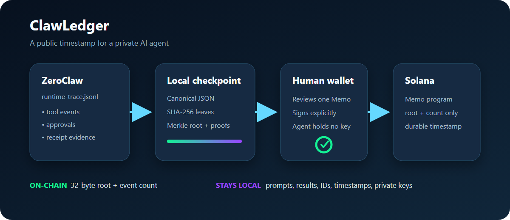

# ClawLedger

[](https://github.com/leafwithered/clawledger/actions/workflows/tests.yml)

**A public timestamp for a private AI agent.**

ClawLedger turns ZeroClaw's local JSONL audit events into a domain-separated
SHA-256 Merkle tree, then exposes the root as a wallet-signable Solana Action.
The operator gets a durable, independently verifiable checkpoint without
publishing prompts, tool arguments, results, or private keys.

This is a working ZeroClaw + Solana use case for the Superteam Brasil
"Build Solana-native plugins for ZeroClaw" bounty. It deliberately uses the
stock ZeroClaw release and its built-in `shell` tool: the problem is a T1
composition problem, not a reason to add unnecessary WASM.



## Final evidence

- **Demo:** [2:46 narrated evidence video](https://youtu.be/7K9gqqYrvOk) ([GitHub backup](docs/clawledger-demo.mp4))
- **Real Telegram validation:** [sanitized 200-event channel record](docs/CHANNEL_VALIDATION.md)
- **Finalized devnet transaction:** [Solana Explorer](https://explorer.solana.com/tx/N3mzTr1YAWw84b2irzd9Cr4cmPd9JHZSmZaUq3PPTr9xYPLfbJZZEqCMP417164U6exTiBA9kjXZ7pf4PHSQviU?cluster=devnet)
- **Reproduction and tests:** [validation evidence](docs/VALIDATION.md)
- **Public showcase:** [X post](https://x.com/leafmyx/status/2084590054178181156)

## Judge it in 90 seconds

- **Real channel:** a bound Telegram operator drove stock ZeroClaw v0.8.3 to
  create and independently verify a 200-event checkpoint; see
  [the sanitized channel record](docs/CHANNEL_VALIDATION.md).
- **Safety:** the agent never receives a wallet key. The local signer decodes
  the unsigned transaction and refuses anything except the expected wallet,
  fee payer, and one account-free Memo instruction; see
  [the threat model](docs/THREAT_MODEL.md).
- **Reproducibility:** Python 3.11+ is the only runtime dependency. The public
  suite has 17 tests and CI covers Python 3.11 and 3.14; see
  [the validation guide](docs/VALIDATION.md).
- **Live proof:** the exact Memo for the real Telegram run is finalized on
  Solana devnet and independently verified; see
  [the public anchor evidence](docs/FINALIZED_ANCHOR.json) and
  [the anchor handoff](docs/ANCHOR_HANDOFF.md).

The submission-ready narrative and the under-three-minute capture details are
in [the submission brief](docs/SUBMISSION.md) and
[the demo runbook](docs/DEMO.md).

[Watch the 2:46 narrated evidence demo](https://youtu.be/7K9gqqYrvOk), covering the
real Telegram checkpoint, trust boundary, finalized devnet proof, and
reproduction path without exposing private channel data.

## The gap it closes

ZeroClaw already emits structured events to
`~/.zeroclaw/data/state/runtime-trace.jsonl`. Tool receipts prove successful
tool results inside their active HMAC scope, but the official documentation is
explicit that receipt keys are ephemeral and a persistent receipt database is
still planned.

ClawLedger adds a narrow durability layer:

1. Read an operator-selected range of the local JSONL trace.
2. Canonicalize each complete JSON event and hash it locally.
3. Build a Merkle root with domain-separated leaf and node hashes.
4. Put only `root + event count` in a Solana Memo transaction.
5. Require the operator's wallet to review, sign, and broadcast.
6. Later verify both the local event range and the finalized on-chain Memo.

ClawLedger does **not** claim to make an already-compromised runtime honest. It
proves that the checkpointed event bytes have not changed since the on-chain
anchor.

## Custody tier

**T1 — Build, never sign.** The service accepts a public wallet address only.
It builds an unsigned Memo transaction containing one checkpoint and leaves
the sole signature slot empty. It has no parameter, config key, or code path
for a seed phrase or private key.

## Quick start

Python 3.11+ is the only dependency.

### Windows PowerShell

```powershell
git clone https://github.com/leafwithered/clawledger.git
```

```powershell
cd clawledger
$env:PYTHONPATH = "src"

python -m clawledger checkpoint `
  --input fixtures/runtime-trace.sample.jsonl `
  --output checkpoint.json

python -m clawledger verify `
  --input fixtures/runtime-trace.sample.jsonl `
  --manifest checkpoint.json

python -m clawledger proof `
  --manifest checkpoint.json `
  --event-id 22222222-2222-4222-8222-222222222222
```

### macOS/Linux Bash

```bash
git clone https://github.com/leafwithered/clawledger.git
cd clawledger
export PYTHONPATH=src

python -m clawledger checkpoint \
  --input fixtures/runtime-trace.sample.jsonl \
  --output checkpoint.json

python -m clawledger verify \
  --input fixtures/runtime-trace.sample.jsonl \
  --manifest checkpoint.json

python -m clawledger proof \
  --manifest checkpoint.json \
  --event-id 22222222-2222-4222-8222-222222222222
```

Serve the Solana Action:

```powershell
python -m clawledger serve-action --manifest checkpoint.json
```

The server exposes a local Phantom signer and the raw Action endpoint:

```text
http://127.0.0.1:8787/anchor
http://127.0.0.1:8787/api/actions/anchor
```

The signer re-decodes the returned transaction in the browser and refuses to
open Phantom unless it contains the expected wallet signer, exactly one
account-free Memo instruction, and the manifest-derived Memo. Phantom remains
the only component that can sign or broadcast.

After the wallet broadcasts the transaction, verify the finalized Memo and
record the signature in the manifest:

```powershell
python -m clawledger verify-anchor `
  --manifest checkpoint.json `
  --signature <SOLANA_SIGNATURE> `
  --write-signature
```

## Run the test suite

Windows PowerShell:

```powershell
$env:PYTHONPATH = "src"
python -m unittest discover -s tests -v
```

macOS/Linux Bash:

```bash
export PYTHONPATH=src
python -m unittest discover -s tests -v
```

With an official ZeroClaw binary available, run the complete reproducibility
check in one command:

```powershell
powershell -NoProfile -ExecutionPolicy Bypass -File .\scripts\validate_all.ps1 `
  -ZeroClawExe <PATH_TO_ZEROCLAW_EXE>
```

On macOS/Linux, run the equivalent Bash validation:

```bash
bash scripts/validate_all.sh --zero-claw /path/to/zeroclaw
```

The tests cover:

- deterministic canonicalization and checkpoint verification;
- duplicate event-ID rejection;
- detection of a modified audit event;
- detection of modified manifest leaf metadata or a non-derived Memo;
- inclusion proofs for even and odd Merkle trees;
- pure-Python base58 and Solana short-vector encoding;
- unsigned legacy Memo transaction round trips;
- exact finalized-transaction shape enforcement and extra-instruction
  rejection;
- the complete local Solana Action GET/POST flow, `actions.json`, CORS, and
  specification-shaped errors.

## ZeroClaw setup

Use rotating persistence so an operator keeps the source evidence:

```toml
[observability]
log_persistence = "rolling"
log_persistence_max_bytes = 10485760
log_persistence_rotate_daily = true
log_persistence_retention_max_files = 30
log_tool_io = "redacted"

[sop]
sops_dir = "<absolute-path>/clawledger/zeroclaw/sops"
step_scope_enforce = true
persist_runs = true
```

Copy `zeroclaw/skills/clawledger` into the agent's configured skills directory,
or use `scripts/install_zeroclaw_skill.ps1` to materialize and install it from
this repository. Validate the included procedure with:

```text
zeroclaw sop validate clawledger-anchor
```

See [the ZeroClaw integration](zeroclaw/README.md),
[the threat model](docs/THREAT_MODEL.md), and
[the demo runbook](docs/DEMO.md). The live bounty requirements and scoring
evidence are mapped in [the bounty alignment](docs/BOUNTY_ALIGNMENT.md).
The repository also includes a safe
[ZeroClaw configuration template](zeroclaw/config.example.toml), a sanitized
[real-runtime validation record](docs/REAL_RUNTIME_VALIDATION.md), and the
[real Telegram channel validation](docs/CHANNEL_VALIDATION.md). The completed
wallet boundary and finalized proof are specified in the
[devnet anchor handoff](docs/ANCHOR_HANDOFF.md).

## Why Solana

A checkpoint is small, public, timestamped, and cheap. Solana's Memo program
provides exactly the durable public commitment needed here, while a Solana
Action gives the operator a transparent wallet review boundary. The chain sees
neither the log nor an encryption key—only a one-way Merkle root and a count.

## Status

- Local checkpoint, proof, verification, and Action flow: implemented and tested.
- Devnet RPC blockhash retrieval and live Action construction: verified.
- Finalized on-chain signature verification: implemented.
- Official ZeroClaw v0.8.3 Skill install/audit and SOP validation: passed.
- Real ZeroClaw model turns created and independently verified a 64-event
  checkpoint through the reviewed Skill script and tool-receipt path.
- A bound Telegram operator drove a real ZeroClaw turn that created and
  verified a stable 200-event checkpoint; the bot returned the independently
  reproduced root `df25687e...4447e29`.
- Bounty fit and judging rubric: mapped to concrete evidence.
- The 200-event Memo is finalized on Solana devnet and the strict verifier
  returned `valid: true` at slot `481112918`.
- A 2:46 English-narrated evidence demo is published in
  `docs/clawledger-demo.mp4`; `docs/DEMO.md` records its contents and the
  privacy-safe live-capture checklist.

## License

MIT

## Primary references

- [ZeroClaw structured logs and JSONL schema](https://github.com/zeroclaw-labs/zeroclaw/blob/master/docs/book/src/ops/observability.md)
- [ZeroClaw tool receipts and their durability boundary](https://github.com/zeroclaw-labs/zeroclaw/blob/master/docs/book/src/security/tool-receipts.md)
- [ZeroClaw SOP syntax](https://github.com/zeroclaw-labs/zeroclaw/blob/master/docs/book/src/sop/syntax.md)
- [Solana Memo transaction guide](https://solana.com/developers/cookbook/transactions/add-memo)
- [Solana `getTransaction` RPC contract](https://solana.com/docs/rpc/http/gettransaction)
- [Solana Actions and `actions.json`](https://solana.com/docs/tools/actions)
